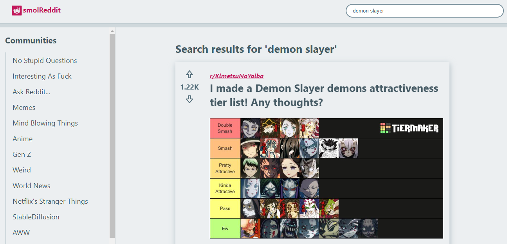
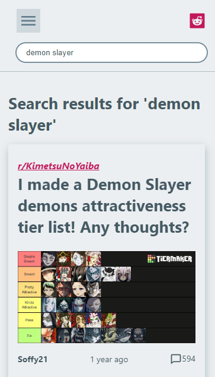

# SmolReddit: Reddit Clone

## Brief

This is a Reddit clone built as a part of the final project in the Codecademy Front-End Certification path. It is a single-page application built using React and React Router. The project aims to demonstrate the ability to build a complex web application using modern web technologies.

## Technologies used

- [Create React App](https://github.com/facebook/create-react-app)
- [React Router](https://reactrouter.com/)
- [React Icons](https://react-icons.github.io/react-icons/)
- [Redux](https://redux.js.org/)

## Features

- Navigation bar with logo and menu button
- Sidebar with list of communities
- Posts displayed in a grid
- Upvote and downvote buttons for each post
- User can navigate to a post and see the comments
- Post search functionality

## Future work

- [ ] Implement pagination for long lists of posts
- [ ] Implement pagination for long lists of comments
